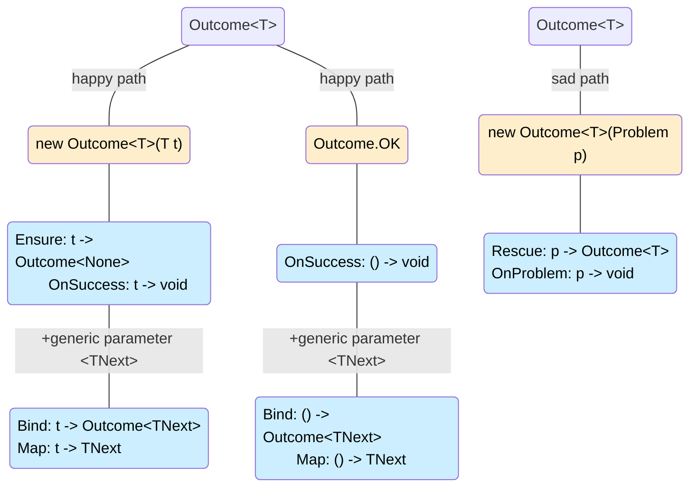

# Composing Outcomes

> [!NOTE]
> All composition operations use the overloaded `|` operator to chain together expressions that return `Outcome<T>` or `AsyncOutcome<T>`

There are six canonical composition operations. 
- Four are executed when your outcome has a value (aka the happy path). 
- The other two are executed when your outcome holds a problem (aka the sad path).

In addition to the six operators, there are three overloads on the happy path for `Outcome<None>` which holds no value.




## Map and Bind

[Monadic](outcomes-as-monads.md) "happy path" operators that transform an Outcome value to the next value and possibly different type.

|operation|description|signature|
|---|---|---|
| `Bind<TNext>` | Invoke the bind function with the current value to obtain a `Outcome<TNext>`. | `Func<T,Outcome<TNext>>` |
| `Map<TNext>` | Invoke the map function with the current value to obtain a `TNext`, and produce a new `Outcome<TNext>` with it. | `Func<T,TNext>` |

The main difference being `Map` will never produce a problem outcome, whereas `Bind` can do what `Map` does but can also produce a problem outcome.


```csharp
public Outcome<Customer> UpdateCachedCustomer(UpdateCustomer command)
{
    CacheEntry<Customer> customer = _cacheService<Customer>.FetchCachedEntity(command.CustomerId);

    return Outcome.Of(customer)
            | EnsureCachedEntity // bind using method name
            | (c => c with { Name = command.Name, Status = command.Status }); // map with lambda, command is captured by closure
}

private static Outcome<T> EnsureCachedEntity<T>(CacheEntry<T> maybeEntity) =>
    maybeEntity switch
    {
        { IsCached: false } => new CacheMissProblem<T>(maybeEntity.Id),
        { Entity: var entity } => entity
    };

```

## Ensure and OnSuccess

|operation|description|signature|
|---|---|---|
| `Ensure` | invoke the validation function with the current value to get a `Outcome{TNone}`. If the returned outcome carries a problem, the original outcome is replaced with the problem outcome. Otherwise the original outcome is returned. | `Func<T,Outcome<TNone>>` |
| `OnSuccess` | invoke the provided action with the current value, and return the original outcome | `Action<T>` |

The following example (using the `Bind` signature) works fine, but the ValidateCommand method bears the responsibility for round-tripping the the input parameter value.
```csharp
public Outcome<UpdateCustomer> ValidateCommand(UpdateCustomer command)
{
    bool isValid = // your validation logic here

    return isValid 
        ? Outcome.Of(command) 
        : new ValidationProblem("Invalid command");
}

```
The **Ensure** operation makes a subtle change and only returns a problem, or an ok outcome. The original outcome only changes to the sad path if a problem is returned.
```csharp
public Outcome<None> ValidateCommand(UpdateCustomer command)
{
    bool isValid = // your validation logic here

    return isValid 
        ? Outcome.Ok 
        : new ValidationProblem("Invalid command");
}

```

Let's revisit an example above to see the **OnSuccess** operator in action. We just want to log a message when we have a cache hit.
```csharp
public Outcome<Customer> UpdateCachedCustomer(UpdateCustomer command)
{
    CacheEntry<Customer> customer = _cacheService<Customer>.FetchCachedEntity(command.CustomerId);

    return Outcome.Of(customer)
            | EnsureCachedEntity
            | LogCacheHit
            | (c => c with { Name = command.Name, Status = command.Status });
    
    static void LogCacheHit(Customer c) => _logger.LogInformation("Successfully fetched customer {CustomerId} from cache", c.Id);
}
```

## Rescue and OnProblem
|operation|description|signature|
|---|---|---|
| `Rescue` | invoke the rescue function with the problem, which returns a `Outcome<T>`. That function can just return the original problem outcome, or it can pass back a new success outcome. | `Func<Problem,Outcome<T>>` |
| `OnProblem` | invoke the provided action with the current problem, and return the original outcome | `Action<Problem>` |

**Rescue** is the sad path equivalent of **Ensure**. It allows you to inspect a problem and decide whether to return a new success outcome, or just pass the original problem back.

It's only useful if the problem contains enough information to be able to determine a valid success outcome, unless you can produce one by other means. 

In this awful example, the business realised that returning a problem on a customer cache miss was not ideal, and decided to perform an UPSERT instead, creating a default customer instead. 

The problem contains the customer id, so we can use that to create a default customer.

```csharp
public Outcome<Customer> UpdateCachedCustomer(UpdateCustomer command)
{
    CacheEntry<Customer> customer = _cacheService<Customer>.FetchCachedEntity(command.CustomerId);

    return Outcome.Of(customer)
            | EnsureCachedEntity
            | CreateDefaultCustomerOnCacheMiss
            | (c => c with { Name = command.Name, Status = command.Status });
    
    static Outcome<Customer> CreateDefaultCustomerOnCacheMiss(Problem p) => p switch{
        CacheMissProblem<Customer> cacheMiss => new Customer { Id = cacheMiss.Id, Name = "Default Customer", Status = "Unknown" },
        _ => p // pass the original problem back if it's not a cache miss
    };
}

```

**OnProblem** example
Let's add to our **OnValue** example to see the **OnProblem** operator in action. We also want to log a message when we have a cache miss problem.
```csharp
public Outcome<Customer> UpdateCachedCustomer(UpdateCustomer command)
{
    CacheEntry<Customer> customer = _cacheService<Customer>.FetchCachedEntity(command.CustomerId);

    return Outcome.Of(customer)
            | EnsureCachedEntity
            | LogCacheHit
            | LogCacheMiss
            | (c => c with { Name = command.Name, Status = command.Status });
    
    static void LogCacheHit(Customer c) => _logger.LogInformation("Successfully fetched customer {CustomerId} from cache", c.Id);
    static void LogCacheMiss(Problem p) 
    {
        if(p is CacheMissProblem<Customer> cacheMiss)
            _logger.LogInformation("Cache miss for customer {CustomerId}", cacheMiss.Id;
    }
}
```
// TODO: we could make a strongly typed OnProblem operator that uses a generic TProblem type parameter which is only invoked if the problem is of the expected type. 
// This would save us from having to do a type check and cast in the body of the LogCacheMiss method.

## Value-less overloads
The three happy path operators also have overloads for `Outcome<None>` which holds no value. 

They exist to save you (or your agentic self) from having to type the discard operator `_` in lambda expressions, and make it more clear that you are not using a value from the outcome in the body of the operator.

|operation|signature|
|---|---|
| `Bind<TNext>` | `Func<Outcome<TNext>>` |
| `Map<TNext>` | `Func<TNext>` |
| `OnSuccess` | `Action` |

## Multiple parameters with Tuples and spreading

In the examples above, you might have noticed how readable composition is when you work with methods over lambda functions. 
These are deeply contrived examples where the methods take a single input value.

But we can also work with multiple input values using outcomes that hold value tuples. 

Overloads of the composition operators automatically spread the member values in those tuples for methods that take multiple parameters (support for up to 4 parameters).

```csharp
public static Outcome<int> VerySillyExample(int firstInput) =>
    Outcome.Of(firstInput)
    | NextInput(13)
    | AndAnotherInput(42)
    | AddThem;
    
private static Func<int, (int, int)> NextInput(int b) => a => (a, b);
private static Func<int, int, (int, int, int)> AndAnotherInput(int c) => (a, b) => (a, b, c);
private static int AddThem(int a, int b, int c) => a + b + c;
```

## Summary
- All operations go through the `|` operator.
- Three of our operators can switch you from the happy path to the sad path or back: `Bind`, `Ensure` and `Rescue`.
- `Map` is transforming values on the happy path.
- `OnSuccess` and `OnProblem` are for performing side effects, and don't change the outcome.
- Tuples of up to four items are spread to input parameters.

---
### Index
- [Why Outcomes?](why-outcomes.md)
- [What is a Problem?](what-is-a-problem.md)
- [Creating Outcomes](creating-outcomes.md)
- this: Composing Outcomes
- [Resolving Outcomes](resolving-outcomes.md)

### further reading / miscellaneous
- [Outcome Aggregation](outcome-aggregation.md)
- [Adapting to Outcomes](outcome-adaptation.md)
- [Outcomes as Monads](outcomes-as-monads.md)